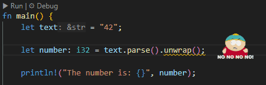

<h1 align="center">Rust Panic Highlighter</h1>

The **Rust Panic Highlighter** extension for Visual Studio Code highlights lines of code containing common panic triggers in Rust, such as `panic!()`, `unwrap()`, and `expect()`. It provides visual warnings directly in the editor to help developers identify potentially dangerous code that could cause runtime panics.

## Features

- **Highlight Panic Triggers**: Highlights occurrences of `panic!()`, `unwrap()`, `expect()`, and other common panic triggers in Rust code.
- **Customizable Icon**: You can choose a custom icon to be displayed next to the panic triggers, with adjustable size and positioning.

## Extension Settings

You can customize the behavior of the Rust Panic Highlighter through the extension settings in Visual Studio Code.

To change these settings:

  1. Open the Command Palette (Ctrl+Shift+P or Cmd+Shift+P on macOS).

  2. Search for and select Preferences: Open Settings (UI).

  3. In the search bar, type Rust Panic Highlighter to filter the relevant options.

  4. Adjust the settings using the user interface.

This extension adds several configurable settings to control its behavior:

### Diagnostic Settings

* **`rustPanicHighlighter.diagnostic.severity`**:  
  Set the severity level for Rust panic diagnostics.  
  - Options: `Error`, `Warning`, `Information`, `Hint`  
  - Default: `Warning`  

* **`rustPanicHighlighter.diagnostic.ignoreInTestBlock`**:  
  Ignore Rust panic diagnostics within test blocks to reduce unnecessary noise.  
  - Default: `true`  

* **`rustPanicHighlighter.diagnostic.ignoredPanics`**:  
  List of panic types to ignore for diagnostics. Leave empty to enable all.  
  - Supported panic types: `panic`, `unwrap`, `unwrap_unchecked`, `unwrap_err`, `unwrap_err_unchecked`, `expect`, `todo`, `unimplemented`, `assert`, `assert_eq`, `assert_ne`  
  - Default: `[]`  

### Icon Settings

* **`rustPanicHighlighter.icon.enabled`**:  
  Enable or disable the display of icons next to panic triggers.  
  - Default: `true`  

* **`rustPanicHighlighter.icon.path`**:  
  Specify the path to an icon or a folder of icons to display at the end of the line.
  - Supports file formats: `.gif`, `.png`, `.jpg`, `.jpeg`, `.svg`  
  - Directory support: Provide a directory path ending with `/` to randomly choose an image from the directory.  
  - Use `'default'` to load the extension's default icon.  
  - Default: `'default'`  

* **`rustPanicHighlighter.icon.minXPositionEnabled`**:  
  Enable a minimum X position for the icon.  
  - When enabled (`true`), the icon will be placed at least 100 characters from the start of the line.  
  - Default: `true`  

* **`rustPanicHighlighter.icon.size`**:  
  Specify the size of the icon in pixels.  
  - Defines both width and height, ensuring a square bounding box.  
  - Non-square images preserve their aspect ratio within the bounding box.  
  - Default: `64`  

* **`rustPanicHighlighter.icon.adjustTopPosition`**:  
  Adjust the vertical position of the icon in pixels.  
  - Use positive or negative values for fine-tuning.  
  - Default: `0`

## Known Issues

- **Icons alignment issues:** Depending on your editor settings (e.g., font size, line height), the icon's vertical alignment might not appear as expected. To address this, the `adjustTopPosition` parameter has been added, allowing you to fine-tune the icon's vertical position manually for better alignment.

- **Inaccuracy with `minXPositionEnabled`:** When `minXPositionEnabled` is activated, it becomes difficult to accurately determine the length of the line, as there is no access to content added by other extensions. This can lead to inconsistent icon positioning, especially when other extensions modify or append elements at the end of the line.

